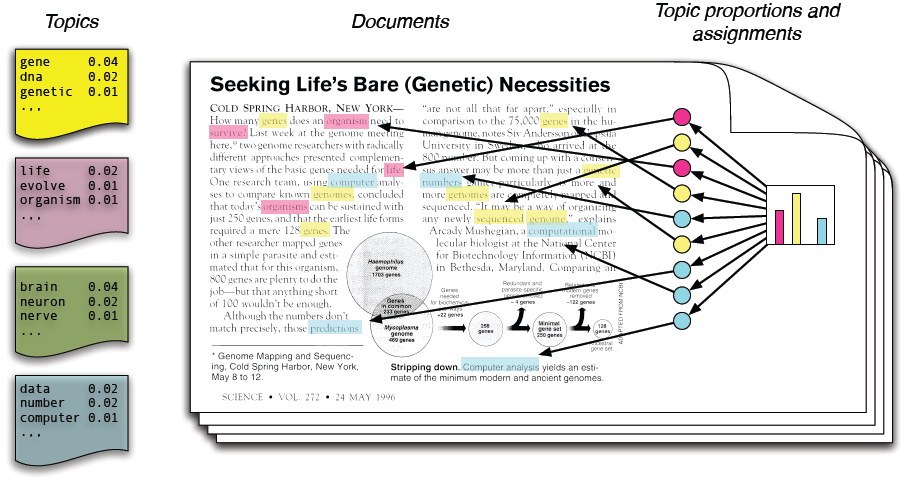
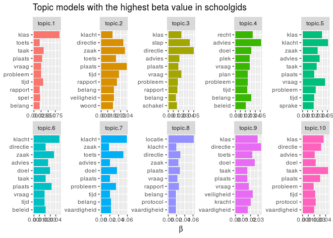
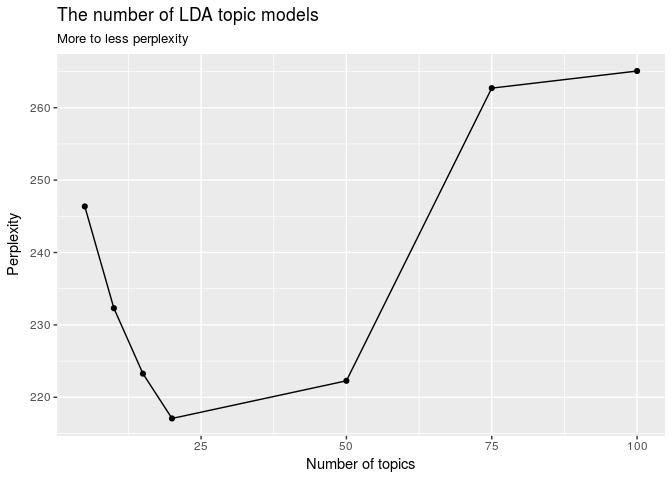

Topic Modeling
================

Topic modeling
==============

-   Topic modeling as dimensionality reduction to uncover the hidden topical patterns

-   Infer the hidden structure with *posterior inference*

LDA (Latent Dirichlet Allocation)
=================================

-   LDA is a popular method for topic modeling.

-   How it (briefly) works?



> -   Go through each document, and randomly assign each word in the document to one of the K topics giving you both topic representations of all the documents and word distributions of all the topics.
> -   For each document `d`...
> -   ....Go through each word `w` in `d`...
> -   1.  `p(topic t | document d)` = the proportion of words in document `d` that are currently assigned to topic `t`, and
>
> -   1.  `p(word w | topic t)` = the proportion of assignments to topic `t` over all documents that come from this word `w`.
>
> -   1.  Reassign `w` a new topic, where you choose topic `t` with probability `p(topic t | document d) X p(word w | topic t)`. [**(Source)**](https://www.quora.com/What-is-a-good-explanation-of-Latent-Dirichlet-Allocation)
>
``` r
library(tm)
library(slam)
library(topicmodels)
library(reshape2)
library(ggplot2)
library(magrittr)
library(broom)
library(tidytext)
```

The data is from the frogged (NLP) data (with 200 samples).

``` r
datafile <- "schoolgids2017v4_frogged_200.rds"
if(!file.exists(datafile)) {
  download.file("https://storage.googleapis.com/schoolgids/schoolgids2017v4/schoolgids2017v4_frogged_200.rds", datafile)
}
tokens <- readRDS(datafile)
```

Our (frogged) corpus only with nouns (in the POS model).

``` r
tokens_nouns <- tokens[tokens$pos == "N", c("school", "lemma")]
head(tokens_nouns)
```

    ##    school      lemma
    ## 4  16JK00     e-mail
    ## 7  16JK00    website
    ## 13 16JK00     inhoud
    ## 19 16JK00 schoolgids
    ## 25 16JK00     school
    ## 29 16JK00       jaar

LDA is quite sensitive for noise that small changes in the topics might lead to great differences. In that sense, it is useful to stop the most occured redundant words before performing LDA.

``` r
stop_nouns <- c("kind", "school", "groep", "leerling", "ouder", "onderwijs", "leerkracht", "jaar", "schooljaar", "informatie", "activiteit", "ondersteuning", "basisschool", "gesprek", "week", "contact", "directeur", "website", "e-mail", "afspraak", "team", tm::stopwords("dutch") )
tokens_nouns_stop <- tokens_nouns[!grepl(paste(stop_nouns, collapse="|"), tokens_nouns$lemma),]
# words less than or equal to 'n' char
tokens_nouns_stop <- tokens_nouns_stop[(which(nchar(tokens_nouns_stop$lemma) >= 4)), ]
noun_dtm <- create_dtm(docs = tokens_nouns_stop$school, terms = tokens_nouns_stop$lemma)
inspect(noun_dtm)
```

    ## <<DocumentTermMatrix (documents: 195, terms: 3041)>>
    ## Non-/sparse entries: 31047/561948
    ## Sparsity           : 95%
    ## Maximal term length: 24
    ## Weighting          : term frequency (tf)
    ## Sample             :
    ##         Terms
    ## Docs     advies directie klacht klas plaats probleem tijd toets vraag zaak
    ##   03RV00     28       14     24   16     12       19   10    10    16   18
    ##   05AT00     21       33     15   16     31       17   13    23    14   24
    ##   07EI00     19       28     38   23     25       17    9    18     7   13
    ##   07TH00     31       17     18   29     23       16   18    27    20   20
    ##   09XJ00     19       15     25   48     17       18   17    19    23   13
    ##   10XE00      8       17      6   19     18       18   22    18     8   18
    ##   13CP00     13       21      9   14     17       13   14    16    12   18
    ##   15GL00     18       19     13   22     12        9   10    14    20   22
    ##   19NV00     27       13      5    5     33       15   13    11    10   16
    ##   20TN00     17       11      8   14     18       19   15    14    12   20

We can run our topic model with 'k' number of *k* hyperparameter.

-   k = number of topics

-   alpha = 'dispersion' parameter

-   high alpha = many topics per documents

-   low alpha = fewer topics per document

-   default = 50/k

``` r
# set number of topics to start with
k <- 50
# set model options
control_LDA_VEM <-
  list(estimate.alpha = TRUE, alpha = 50/k, estimate.beta = TRUE,
       verbose = 0, prefix = tempfile(), save = 0, keep = 0,
       seed = as.integer(100), nstart = 1, best = TRUE,
       var = list(iter.max = 10, tol = 10^-6),
       em = list(iter.max = 10, tol = 10^-4),
       initialize = "random")
# set sequence of topic numbers to iterate over
seq <- c(5, 10, 15, 20, 50, 75, 100)

### Using parallel computing to speed up the computations.
if (file.exists("LLDA.Rdata")) {
  load(file = "LLDA.Rdata")
} else {
  # set parallel processing options & initiate cores
  library(doParallel)
  num_workers <- (detectCores() - 1) * 8
  cl <- makeCluster(num_workers, outfile = "")
  clusterEvalQ(cl, library(topicmodels))
  clusterExport(cl, c("noun_dtm", "control_LDA_VEM"))
  #Run the model
  system.time({
    LLDA <<- clusterApplyLB(cl, seq, function(d) {topicmodels::LDA(noun_dtm, control = control_LDA_VEM, d)})
  })
  stopCluster(cl)
  save(LLDA, file = "LLDA.Rdata")
}
```

Top 5 terms with the highest beta probabilities in the 10 topics output.

``` r
terms(LLDA[[2]], 5)
```

    ##      Topic 1  Topic 2    Topic 3    Topic 4  Topic 5  Topic 6 
    ## [1,] "klas"   "plaats"   "directie" "advies" "klacht" "klacht"
    ## [2,] "taak"   "zaak"     "stap"     "recht"  "vraag"  "zaak"  
    ## [3,] "tijd"   "directie" "vraag"    "belang" "klas"   "plaats"
    ## [4,] "plaats" "tijd"     "klas"     "doel"   "advies" "doel"  
    ## [5,] "vraag"  "rapport"  "advies"   "vraag"  "zaak"   "advies"
    ##      Topic 7       Topic 8    Topic 9      Topic 10  
    ## [1,] "klacht"      "locatie"  "directie"   "taak"    
    ## [2,] "toets"       "directie" "klas"       "klas"    
    ## [3,] "doel"        "plaats"   "doel"       "directie"
    ## [4,] "probleem"    "rapport"  "veiligheid" "plaats"  
    ## [5,] "vaardigheid" "zaak"     "toets"      "protocol"

We can look at "beta", which is per-topic-per-word probabilities. A log ratio (`exp()`) helps understand the size of the difference.

``` r
lda10 <- LLDA[[2]]
lda_terms <- data.frame(term = lda10@terms, topic = round(exp(t(lda10@beta)), 6), stringsAsFactors = FALSE)
lda_terms <- melt(lda_terms, id.vars = "term", variable.name = "topic", value.name = "beta")

### Tidy way (same as above)
lda_terms_tidy <- tidy(lda10, matrix = "beta")

ordered <- lda_terms[order(lda_terms$beta, decreasing = TRUE), ]
ordered <- by(ordered, ordered$topic, head, n=10)
top10terms <- Reduce(rbind, ordered)
head(top10terms)
```

    ##          term   topic     beta
    ## 1153     klas topic.1 0.089545
    ## 2439     taak topic.1 0.034109
    ## 2504     tijd topic.1 0.032444
    ## 1768   plaats topic.1 0.028626
    ## 2762    vraag topic.1 0.025452
    ## 1890 probleem topic.1 0.024646

``` r
ggplot(top10terms, aes(x = reorder(term, beta), y = beta, fill = as.factor(topic))) +
  geom_col(show.legend = FALSE) +
  facet_wrap( ~ topic, ncol = 5, scales = "free") +
  coord_flip() +
  labs(title = "Topic models with the highest beta value in schoolgids",
       x = NULL, y = expression(beta))
```



Validating the topic models
---------------------------

-   To be sure if the model is working

1.  Face validity

-   Topic modeling should identify "good" topics suitable for human interpretation

-   *Word intrusion:* Identify a spurious word inserted into a topic

-   *Topic intrusion:* Identify a topic that was not associated with the document by the model.

-   You can look at the Cohen's kappa to measure the intercoder reliability

1.  Measuring perplexity/predictive likelihood measures (measuring the log-likelihood)

-   Perplexity can give an ideal measurement of how likely are the actual texts differentiated into topics in the model

Seeing in a graph.

``` r
perplexity <- data.frame(k = seq,
                         perplex = sapply(LLDA, perplexity))
ggplot(data = perplexity, aes(k, perplex)) +
  geom_point() +
  geom_line() +
  labs(title = "The number of LDA topic models",
       subtitle = "More to less perplexity",
       x = "Number of topics",
       y = "Perplexity")
```



-   Although you can use perplexity score in your decision process of *k* number of topics, our intuition and domain knowledge as a researcher is still important.

Topic modelling offers a quick and convenient method to perform unsupervised classification of a corpus of documents; however, one needs to examine the results carefully to determine if the structure makes sense.

------------------------------------------------------------------------

References
==========

Blei, D. (2009). *Topic Models*. Retrieved from the video lesson <http://videolectures.net/mlss09uk_blei_tm/>

Chang, J., Boyd-Graber, J., Wang, C., Gerrish, S., and Blei, D. (2009). *Reading Tea Leaves: How Humans Interpret Topic Models.* Neural Information Processing Systems. <http://www.umiacs.umd.edu/~jbg/docs/nips2009-rtl.pdf>

van Atteveldt, W. (2018). *Running and validating topic models.* CCS Hannover, Feb 2018. <http://i.amcat.nl/lda/2_lda.pdf>
